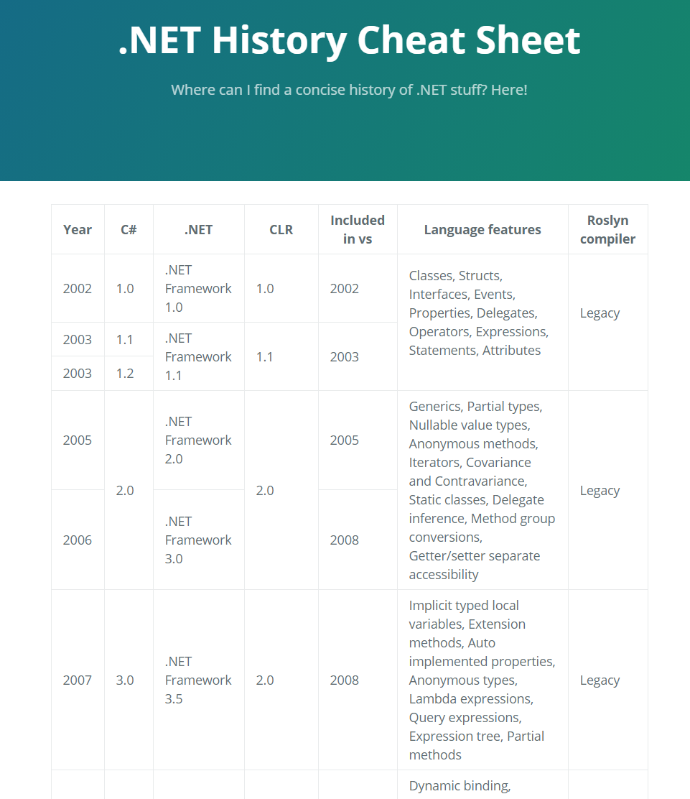

Dotnet Shmotnet
============

    

[Dotnet Shmotnet](https://mantinband.github.io/dotnet-shmotnet/) is a simple static web page with a summary of the .NET history.

---

## Setup

1. `clone` this repo
2. `bundle install`
3. `bundle exec jekyll serve`
4. The site is served locally at `http://localhost:4000/dotnet-shmotnet/`

---

## Contributing

Please go ahead and add/remove/update anything you see fit!
The main table sits under `index.md`. If you aren't familiar with the `^^` syntax in the table, its simply a merge with the cell above (take a look at [Jekyll Spaceship](https://github.com/jeffreytse/jekyll-spaceship) for more details and other syntaxes provided by this cool plugin).

After the changes are introduced to the `main` branch the deployment should take a few minutes. You can track the deployment status [here](https://github.com/mantinband/dotnet-shmotnet/actions/workflows/build-jekyll.yml).

### New to Jekyll but want to contribute?

Take a look [here](https://github.com/jekyll/jekyll) for more details.

---

## Credits

- [Jekyll](https://github.com/jekyll/jekyll) - A blog-aware static site generator in Ruby.
- [Jekyll Spaceship](https://github.com/jeffreytse/jekyll-spaceship) - A minimalistic, powerful and extremely customizable Jekyll plugin.

---

## License

This project is licensed under the terms of the [MIT](https://github.com/mantinband/dotnet-shmotnet/blob/main/LICENSE) license.
